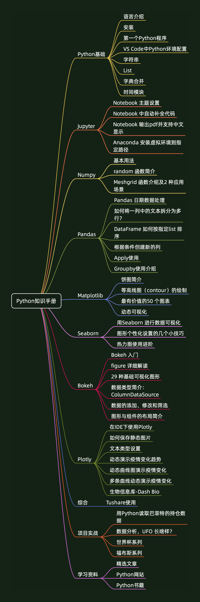

- [Python知识手册](#python知识手册)
  - [导读](#导读)
  - [手册内容](#手册内容)
  - [主要更新内容](#主要更新内容)
  - [如何阅读和使用《手册》](#如何阅读和使用手册)
  - [手册版本历史信息](#手册版本历史信息)
  - [如何获取《Python知识手册》](#如何获取python知识手册)

# Python知识手册

《Python知识手册》 由 微信公众号 **「Python数据之道」** 出品

作者：阳哥

个人网站： [http://liyangbit.com](http://liyangbit.com)

手册获取地址：[《Python知识手册》](https://github.com/liyangbit/Python-Knowledge-Handbook/tree/master/handbook)

## 导读

大家好，我是 阳哥 。

《Python知识手册》由「Python数据之道」出品，最新版会在公众号上进行发布，大家可以在公众号「Python数据之道」后台回复 **600** 获取最新版。

<!-- 

 -->

虽然我写了一些关于 Python 零基础入门的文章，但《Python知识手册》 并没有比较完整的
覆盖 Python 的基础知识。因此，针对手册的阅读，各位读者最好有一些 Python 的基本功底。

## 手册内容

2019 年 2 月，「Python数据之道」发布了《Python知识手册》的第一个版本（v2018版）。

2022 年 2 月，《Python知识手册》更新到 V4.0 版。

手册封面如下：

<!--  -->

当前版本中，手册主要包含以下几方面相关的内容：

<!-- 

    

 -->

<!-- - Python 基础知识
- Jupyter Notebook
- Numpy
- Pandas
- Matplotlib
- Seaborn
- Bokeh
- Plotly
- 若干个项目实战案例
- Python 学习资料 -->

如没有特殊的说明，手册中代码的运行环境如下：

- windows 7 或 windows 10 系统 或 MacOS 系统
- python 3.5 或 python 3.5+
- Anaconda / Jupyter Notebook / VS Code

## 主要更新内容

1. 添加关于Python视频制作工具 `Manim` 介绍的内容，由于涉及不少 gif图以及视频，在pdf中不能显示，此部分内容以链接形式添加；

1. 「用Python快速获取基金的持仓变化情况」中的内容，部分数据接口失效，进行更新；

1. 更新部分书写错误；

<!-- ## 与优秀者同行

从 V3.0 版开始，加强了延伸阅读的内容，一个人的水平、时间和经验总是有限的。在《手册》中，以介绍或链接的方式，添加了部分内容，包括书籍介绍、网站及博客介绍、翻译内容链接、读者投稿文章的链接等，这些内容，可以在《手册》的学习资料章节进行了解。 -->

## 如何阅读和使用《手册》

《Python知识手册》的大部分章节来自公众号「Python数据之道」发布的内容，每个章节，基本上是一个独立的内容。因此，读者可以根据自己的知识储备情况，有针对性的阅读，熟悉的章节可以快速的阅览或者跳过，对于有兴趣的内容，可以详细阅读和练习。

## 手册版本历史信息

《Python知识手册》更新信息情况如下：

| 版本号  | 日期  | 主要内容描述  |
|---|---|---|
|v4.0| 2022-02-24  | 添加Manim相关内容，更新部分财经实践内容以及一些书写错误|
|v3.3| 2021-09-16  | 更新 Pandas相关内容，添加财经实践板块|
|v3.2| 2021-08-02  | 更新 Pandas、Plotly等相关内容|
|v3.1| 2021-07-12  | 更新 Matplotlib、Pandas等相关内容|
|v3.0| 2021-01-01  | 更新 VS Code、Pandas、Plotly 以及学习资料等内容|
|v2.2| 2020-05-11  | 更新Plotly相关内容和Python学习资料的章节|
|v2.1| 2020-02-14  | 添加“导读” 和 “Python网站”  章节，移除部分项目|
|v2.0.1| 2020-02-02  | 修复2.0 版没有书签的 bug  |
|v2.0| 2020-02-02  | 添加 Python 基础知识；添加 Plotly 内容  |
|v2018| 2019-02-25  | 第一版，初始版本  |

## 如何获取《Python知识手册》

手册获取地址：[《Python知识手册》](https://github.com/liyangbit/Python-Knowledge-Handbook/tree/master/handbook)

<!-- 

 -->

