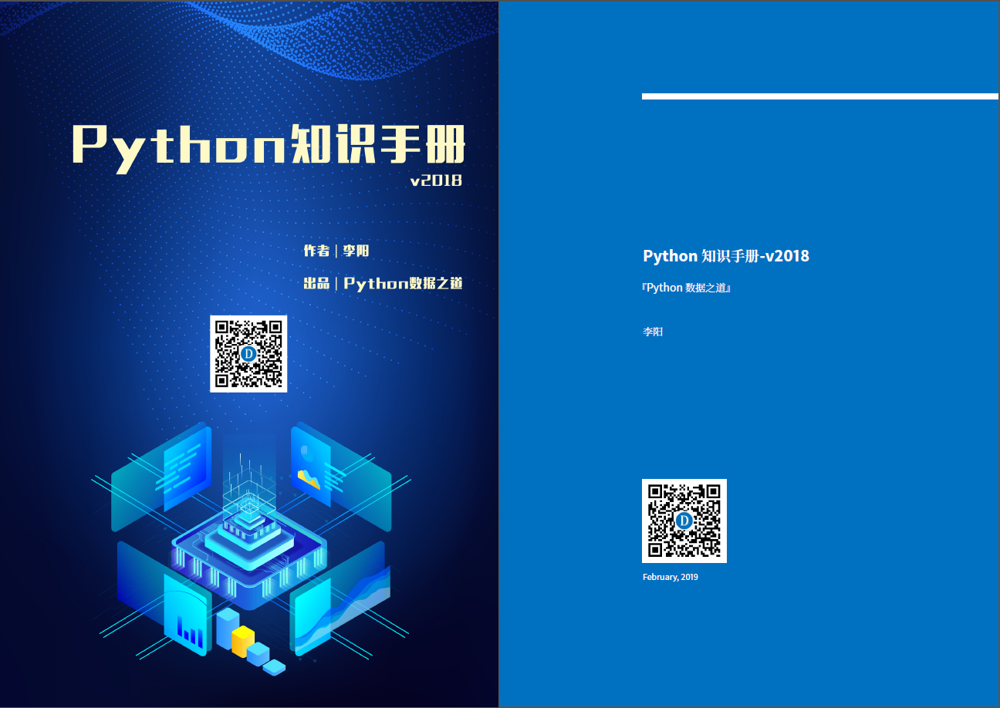
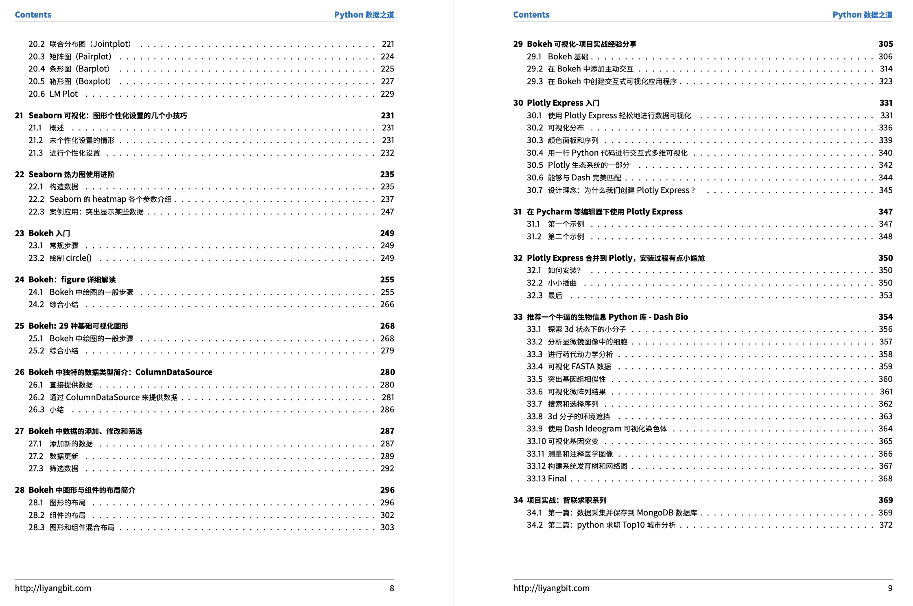

# 1. Python知识手册

- [1. Python知识手册](#1-python%E7%9F%A5%E8%AF%86%E6%89%8B%E5%86%8C)
  - [1.1. 前言](#11-%E5%89%8D%E8%A8%80)
  - [1.2. 微信公众号](#12-%E5%BE%AE%E4%BF%A1%E5%85%AC%E4%BC%97%E5%8F%B7)
  - [1.3. 知识星球](#13-%E7%9F%A5%E8%AF%86%E6%98%9F%E7%90%83)
  - [1.4. 感谢的话](#14-%E6%84%9F%E8%B0%A2%E7%9A%84%E8%AF%9D)

《Python知识手册》 由 『Python数据之道』出品

作者：李阳

个人网站： [http://liyangbit.com](http://liyangbit.com)

手册获取地址：[《Python知识手册-v2018》](https://github.com/liyangbit/Python-Knowledge-Handbook/tree/master/handbook/Version-2018)

## 1.1. 前言

“种一棵树，最好的时间是十年前，其次是现在。”

博客刚兴起不久的时候，大概 04年左右，我就开始写一些博客文章，但工作之后基本上就没有坚持写了。
现在想来，有些可惜了。

从 2016年底开始，再次坚持写作，并于2017年开通了微信公众号『Python数据之道』。
期间陆陆续续，写了些许Python相关的内容，希望借此机会，将这些显得零散的内容整合起来，形成一本小册子，名曰《Python知识手册》，一共365页。手册的封面如下：

    

    

虽然我写了一些关于 Python零基础入门的文章，但《Python知识手册》不是一本从 Python
零基础开始的手册，针对手册的阅读，各位读者最好有一些 Python 的基本功底。

当前版本中（v2018），手册主要包含以下几方面相关的内容：

* Jupyter Notebook
* Numpy
* Pandas
* Matplotlib
* Seabon
* Bokeh
* 若干个项目实战案例

如没有特殊的说明，手册中代码的运行环境如下：

* windows 7 或 windows 10 系统
* python 3.5 或 python 3.6
* Anaconda / PyCharm / Jupyter Notebook

若上述这些内容，能给诸位读者带来益处，我觉得付出些辛劳，也是值得的。当然，由于个人水平有限，文章中内容难免有不准确的地方，不足之处，敬请理解。

若对我发的内容有兴趣，欢迎大家通过以下途径来关注或者加入社群。

## 1.2. 微信公众号

公众号『Python数据之道』秉承“让数据更有价值”的理念，主要分享数据相关的内容，包括数据分析，挖掘，可视化，机器学习，深度学习等。公众号所有文章都可以免费阅读，欢迎关注。

## 1.3. 知识星球

由于个人时间和精力有限，对于众多读者的提问和需求不能一一交流与回复。
开通了付费的知识星球『Python数据之道成长圈』，希望能够集中有限的时间来更好的交流和互动，同时可以汇聚一部分志同道合的人员，共同成长。

**知识星球主要内容：**

* 作为圈友，我会透过数据，用 Python 分享我的一些观察、分析、思考，以及一些个人经验； 
* 更重要的，是大家的主题分享和切磋讨论

    

## 1.4. 感谢的话

坚持写作，少了许多与家人陪伴的时光，感谢家人对我的支持与理解。
通过『Python数据之道』，结识了不少大佬以及新的朋友，通过交流，让我愈发感到自己的渺小与不足，希望能与诸位共同成长。
感谢 @陈典铖 为《Python知识手册》制作了精美的封面，感谢诸位大佬以及众多读者对手册内容的支持。

当然，由于个人水平有限，文章中内容难免有不准确的地方，欢迎通过公众号联系我。