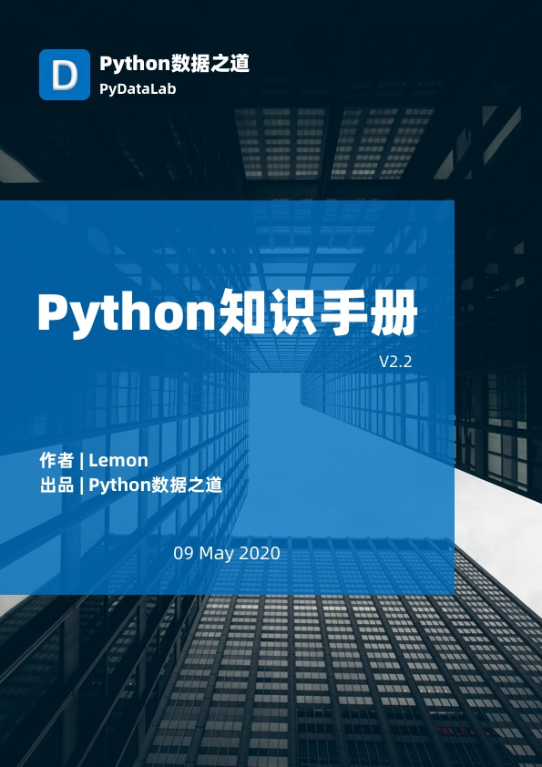

# 1. Python知识手册

《Python知识手册》 由 『Python数据之道』出品

作者：Lemon

个人网站： [http://liyangbit.com](http://liyangbit.com)

手册获取地址：[《Python知识手册》](https://github.com/liyangbit/Python-Knowledge-Handbook/tree/master/handbook/V2.x)

## 1.1 前言

各位读者好，我是 Lemon 。

>“种一棵树，最好的时间是十年前，其次是现在。”

从 2017 年开始，我陆陆续续在公众号「Python数据之道」写了些许 Python 相关的内容，希望借此机会，将这些显得零散的内容整合起来，形成一本小册子，名曰《Python知识手册》。

## 1.2 手册内容

2019 年 2 月，「Python数据之道」发布了《Python知识手册》的第一个版本（v2018版）。

2020 年 5 月 ，《Python知识手册》更新到 V2.2 版，手册的页数从 365 页增加到 440 多页，从内容方面来看，增加了部分 Python 基础知识、Plotly 相关的内容以及修订了第一版的部分内容。重新梳理了Python学习资料相关章节，分为精选文章、Python网站、书籍三个部分

从 V2.0 版开始，后续版本的更新时间间隔会缩短，在 2020 年，公众号「Python数据之道」初步计划会花更多时间和精力来更新这个手册的内容，希望能给大家带来些有价值的内容。

手册 V2.2 的封面如下：

    

虽然我写了一些关于 Python 零基础入门的文章，但《Python知识手册》 并没有比较完整的覆盖 Python 的基础知识。因此，针对手册的阅读，各位读者最好有一些 Python 的基本功底。
当前版本中（v2.2），手册主要包含以下几方面相关的内容：

- Python基础知识
- Jupyter Notebook
- Numpy
- Pandas
- Matplotlib
- Seaborn
- Bokeh
- Plotly
- 若干个项目实战案例
- Python学习资料

手册的部分页面如下：

    

若上述这些内容，能给诸位读者带来益处，我觉得付出些辛劳，也是值得的。

## 1.3 感谢的话

坚持写作，少了许多与家人陪伴的时光，感谢家人对我的支持与理解。通过「Python数据之道」，结识了不少业界前辈以及新朋友，通过交流，让我愈发感到自己的渺小与不足，希望能与诸位共同成长。衷心感谢诸位前辈以及众多读者对「Python数据之道」的支持。

当然，由于个人水平有限，文章中内容难免有不准确的地方，《Python知识手册》会不定期进行更新，更新后的内容可以通过公众号「Python数据之道」 进行获取。

## 1.4 如何获取《Python知识手册》

手册获取地址：[《Python知识手册》](https://github.com/liyangbit/Python-Knowledge-Handbook/tree/master/handbook/V2.x)

